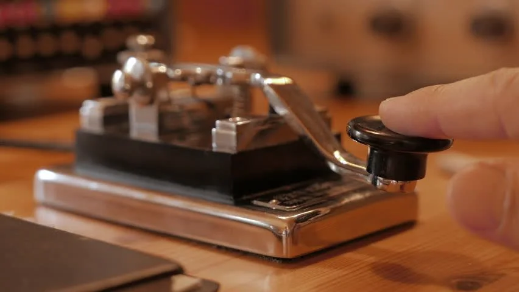

# MorseCode
> Introduction

This is a quick reference to getting started with Morse Code.

<!-- Morse Transmitter Image -->

## **Alphabet**                                        

| Alphabet   |   Code     |
| ---------- | ---------- |
|     A      |    .-      |
|     B      |    -...    |
|     C      |    -.-.    |
|     D      |    -..     |
|     E      |     .      |
|     F      |    ..-.    |
|     G      |    --.     |
|     H      |    ....    |
|     I      |    ..      |
|     J      |    .---    |
|     K      |    -.-     |
|     L      |    .-..    |
|     M      |    --      |
|     N      |    -.      |
|     O      |    ---     |
|     P      |    .--.    |
|     Q      |    --.-    |
|     R      |    .-.     |
|     S      |    ...     |
|     T      |     -      |      
|     U      |    ..-     |
|     V      |    ...-    |
|     W      |    .--     |
|     X      |    -..-    |
|     Y      |    -.--    |
|     Z      |    --..    |

## **Digit** 

| Digit     |   Code     |
| -------   | ---------- |
|     0     |  -----     |
|     1     |  .----     |
|     2     |  ..---     |
|     3     |  ...--     |
|     4     |  ....-     |
|     5     |  .....     |
|     6     |  -....     |
|     7     |  --...     |
|     8     |  ---..     |
|     9     |  ----.     |

## **Punctuation Mark** 

| Punctuation       |   Code     |
| ------------      | ---------- |
|  Full stop        |  .-.-.-    |
|  Comma            |  --..--    |
|  Colon            |  ---...    |
|  Question Mark    |  ..--..    |
|  Apostrophe       |  .----.    |
|  Hyphen           |  -....-    |
|  Forward slash    |  -..-.     |
|  Parentheses      |  -.--.-    |
|  Quotation Mark   |  .-..-.    |
|  At sign          |  .--.-.    |
|  Equals sign      |  -...-     |

